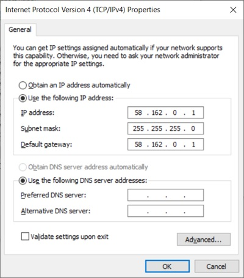
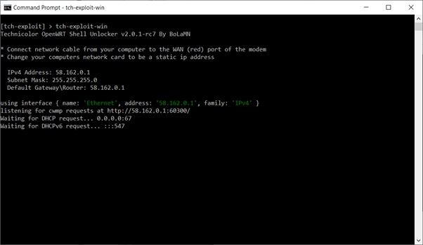
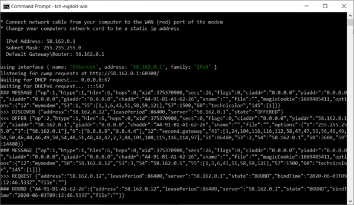
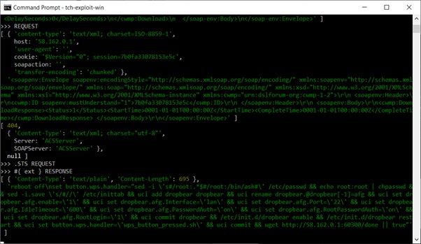

Technicolor OpenWRT Shell Unlocker By BoLaMN

* Connect network cable from your computer to the WAN (red) port of the modem
* Change your computers network card to be a static ip address

  IPv4 Address: 58.162.0.1
  Subnet Mask: 255.255.255.0
  Default Gateway\\Router: 58.162.0.1

Run as admin or sudo as it needs permission to bind on ports lower then 1024

avaliable *optional* arguments --acspass, --acsurl, --dhcponly, --ip, --port, -—tftp, --file, -—file-type

## if you are a n00b, go here
<https://github.com/BoLaMN/tch-exploit/releases>

## building (if you’re extending functionality) 

```
npm install pkg coffee-script -g
npm install
npm run compile 
npm run package
```
## Full example with Windows and Technicolor DJA0231 

Connect your PC's Ethernet port to the modem's WAN port and configure your PC's static IP address accordingly:



From a command prompt confirm with `ipconfig`. Note that the default gateway did not apply due to it being the same IP address as the PC's


Run `tch-exploit-win` from a command prompt. You should get the following screen:



At this point you have to wait bit, might be 20 sec or can even be over 1 min. But the screen starts to fill up like so:



Another 40-50 sec the screen then fills up more with green text:



After another 5-6 sec or so it prompts you to press the WPS button:


Now you press and hold the WPS button for around 3 sec before releasing. On the modem it is the **PAIR** button with two arrows. That button should start to flash and within a couple of seconds the screen says everything is done:


Now you can unplug the Ethernet cable from the WAN port and insert it into one of the LAN ports. Change your PC back to DHCP and then putty to 192.168.0.1 and login as root/root


License: MIT
