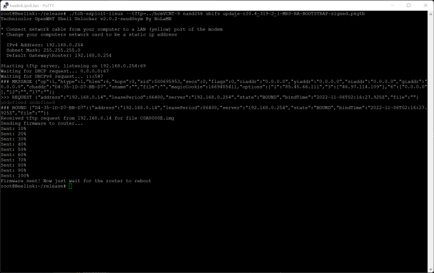
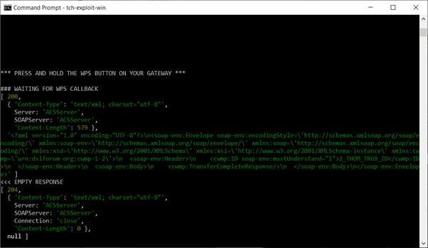
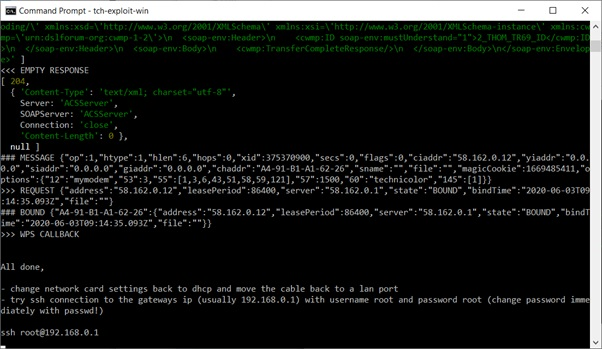

[](https://github.com/seud0nym/tch-exploit/blob/master/LICENSE) 


[](https://github.com/seud0nym/tch-exploit/releases) 


# Technicolor OpenWRT Shell Unlocker

## Instructions

1. [Before You Start](#before-you-start)
1. [Preparation](#preparation)
    * [Modem](#modem)
    * [Computer](#computer)
1. [Type 3 (Non-Rootable) Firmware](#type-3-non-rootable-firmware)
    * [Loading Firmware using BOOTP and TFTP](#loading-firmware-using-bootp-and-tftp)
      * [TFTP Server](#tftp-server)
      * [BOOTP Mode](#bootp-mode)
      * [Restore Computer Network Interface](#restore-computer-network-interface)
      * [Confirm Type 2 Firmware Successfully Booted](#confirm-type-2-firmware-successfully-booted)
      * [If Type 2 Firmware Did NOT Boot](#if-type-2-firmware-did-not-boot)
        * [Firmware Banks Explained](#firmware-banks-explained)
1. [Type 2 (Rootable) Firmware](#type-2-rootable-firmware)
    * [Running tch-exploit](#running-tch-exploit)
    * [After Root Access Acquired](#after-root-access-acquired)
      1. [Extract tch-gui-unhide Scripts](#1-extract-tch-gui-unhide-scripts)
      1. [Optimal Bank Planning](#2-optimal-bank-planning)
      1. [Optionally Upgrade Firmware](#3-upgrade-firmware-optional)
      1. [Harden Root Access](#4-harden-root-access)
      1. [Unlock GUI Features](#5-unlock-gui-features)

## Before You Start

To acquire root access on a Technicolor device, you need the following:

* A computer with either an Ethernet port OR a USB Ethernet adapter
* A USB Stick
* An ethernet cable
* An SSH client:
    * **Windows**: Download [PuTTY](https://www.chiark.greenend.org.uk/~sgtatham/putty/latest.html)
    * **Mac/Linux**: You can use the `ssh` command provided by your distribution
* A basic understanding of running commands in your operating system's terminal program

## Preparation

### Modem

* Remove the cable that connects the device to the internet. This will either be the cable into the red WAN port or the DSL/phone port.
* If the Technicolor device is 4G backup capable, remove the SIM card.
* Determine the current firmware version installed on the device:
    1. Log into your modem through your web browser, usually at http://192.168.0.1/ or http://10.0.0.138/
    1. Click on `Advanced` in the top right corner of the page (skip this step on the Smart Modem Gen 3, as it will automatically take you into the Advanced view).
    1. Click the first box on the top left, usually called “Gateway” or “Modem”
    1. Record the “Firmware Version” shown on the screen
    1. Click on the “Reset” button to restore the device to factory defaults.
* Determine your firmware version **Type** from https://hack-technicolor.readthedocs.io/en/latest/Repository/
    1. Click on your device name in the right side panel menu.
    1. Find your version number in the table and make note of the **Type** (1, 2,or 3) from the first column.
    1. If your device has a **Type 3** firmware, download any **Type 2** firmware for your device.

### Computer

* Download the [latest release](https://github.com/seud0nym/tch-exploit/releases/latest) of `tch-exploit` for your operating system.
    * Extract the contents of the zip file into a directory on your computer.
* Download the [latest release](https://github.com/seud0nym/tch-gui-unhide/releases/latest) of `tch-gui-unhide` for your firmware version (e.g. for a firmware beginning with 20.3.c, download the `20.3.c.tar.gz` file).
    * Copy that file to the USB stick.
* Disable or turn off _all_ network connections, including Wi-Fi, VPN, 4G USB devices, other ethernet connections, etc.
* Find the name of your ethernet connection:
    * **Windows**: Open a command prompt and use the `ipconfig | find "Ethernet adapter"` command to list your ethernet interfaces.
    * **Mac**: Open a terminal window and use either the `networksetup -listallhardwareports` or `ifconfig` command.
    * **Linux**: Open a terminal window and use either the `ip link` or `ifconfig` command, depending on your distribution.

## Type 3 (Non-Rootable) Firmware

You _cannot_ acquire root access to a Type 3 firmware.

The only known method for acquiring root access on a device with Type 3 firmware is to downgrade the device to a Type 2 firmware first.

The first thing to try is loading the Type 2 firmware via TFTP.

### Loading Firmware using BOOTP and TFTP

There are 2 steps to loading firmware via TFTP:

1. Setup a TFTP server that will download the firmware to the device; and
2. Start your device in BOOTP mode so that it will automatically request the firmware from the TFTP server and install it on the device.

#### TFTP Server

You should already have acquired `tch-exploit` for your operating system. If you have Telstra Smart Modem Gen 3, you must use the `seud0nym` version - the original `BoLaMN` version will fail. The `seud0nym` version also has better prompts and some bug fixes.

1. Connect an Ethernet cable into the Ethernet port on your computer, and the other end into any **yellow LAN port** on your device.
1. Copy the firmware file (ending with .rbi for all devices prior to the Smart Modem Gen 3, or ending with .pkgtb for the Gen 3) to the `tch-exploit` directory.
1. Configure networking and start the TFTP server:
    * **Windows**: Run the following commands in an _elevated_ (Administrator) command prompt:
        * _Replace `C:\Users\user\Downloads\release` with the name of the directory containing tch-exploit-win_
        * _Replace `Ethernet` with the name of your ethernet connection_
        * _Replace `<firmware_file>` with the name of the Type 2 firmware you downloaded for your device_
        ```
        cd C:\Users\user\Downloads\release
        netsh interface ipv4 set address name="Ethernet" static 192.168.0.254 255.255.255.0 192.168.0.1
        tch-exploit-win --ip=192.168.0.254 --tftp=<firmware_file>
        ```
    * **Mac**: Run the following commands:
        * _Replace `release` with the name of the directory containing tch-exploit-mac_
        * _Replace `eth0` with the name of your ethernet connection_
        * _Replace `<firmware_file>` with the name of the Type 2 firmware you downloaded for your device_
        ```
        cd release
        sudo ip addr add 192.168.0.254/24 dev eth0
        sudo ./tch-exploit-mac --ip=192.168.0.254 --tftp=<firmware_file>
        ```
    * **Linux**: Run the following commands:
        * _Replace `release` with the name of the directory containing tch-exploit-linux_
        * _Replace `eth0` with the name of your ethernet connection_
        * _Replace `<firmware_file>` with the name of the Type 2 firmware you downloaded for your device_
        ```
        cd release
        sudo ip addr add 192.168.0.254/24 dev eth0
        sudo ./tch-exploit-linux --ip=192.168.0.254 --tftp=<firmware_file>
        ```

#### BOOTP Mode

1. Unplug the power from the modem.
1. Hold in the Reset button using a paper-clip, bamboo skewer, etc.
1. Power on the modem. **DO NOT RELEASE THE RESET BUTTON YET!**
1. The power/status LED on the front of the modem will start slowly flashing white on and off.
1. Release the Reset button.

Your computer screen will show the progress of the firmware being downloaded. 



One the firmware download is complete, the power/status LED on the front of the modem will start to flash more quickly. This means that it is applying the downloaded firmware. When it has completed, the modem will reboot.

#### Restore Computer Network Interface

If you are using the `seud0nym` version of `tch-exploit`, it will automatically exit when it has finished downloading the firmware. If you are using the `BoLaMN` version, you will need to press `Ctrl-C` to exit.

* **Windows**: Run the following command in an _elevated_ (Administrator) command prompt (replace `Ethernet` with the name of your ethernet connection):
    ```
    netsh interface ipv4 set address name="Ethernet" dhcp
    ```
* **Linux/Mac**: Run the following commands (replace `eth0` with the name of your ethernet connection):
    ```
    sudo ip addr del 192.168.0.254/24 dev eth0
    sudo ifdown eth0
    sudo ifup eth0
    ```

#### Confirm Type 2 Firmware Successfully Booted

1. Log into your modem, usually at http://192.168.0.1/ or http://10.0.0.138/
1. Click on `Advanced` in the top right corner of the page (skip this step on the Smart Modem Gen 3, as it will automatically take you into the Advanced view).
1. Click the first box on the top left, usually called “Gateway”.
1. Check the “Firmware Version”:
    * If the firmware version matches the Type 2 firmware you just loaded via BOOTP/TFTP, you can [proceed](#type2) to acquire root access.
    * If the firmware version is still the original Type 3 firmware, life has just become difficult.

#### If Type 2 Firmware Did NOT Boot

If the TFTP appeared to complete successfully, then the problem is more than likely that the device is booting from the wrong firmware bank. This is explained in more detail [below](#banks).

In this case, you need to force the device to switch banks to the firmware you just loaded. This is a very hit-and-miss procedure that involved forcing the device to fail to boot three times, in which case it will automatically switch to the alternate bank, containing the firmware you just loaded. 

The various boot-fail bank switching techniques are explained [here](https://hack-technicolor.readthedocs.io/en/latest/Recovery/#change-booted-bank).

There is another bank switching technique that is not discussed, and is only applicable to current devices that still receive firmware updates over-the-air from Telstra. If the device receives a new firmware over the internet, it will always load that new firmware in the _passive_ bank, never the _active_ bank. Once it reboots, it will be running from the _other_ bank, and you can redo the BOOTP/TFTP procedure to load the Type 2 firmware.

<a name="banks"></a>

>[*Firmware Banks Explained*](https://hack-technicolor.readthedocs.io/en/latest/Recovery/#check-booted-bank)
> ---
> The Technicolor modems are **dual-bank** devices. They work in a very similar fashion to a dual-boot computer system. For example, the computer might have a data partition with personal data and two Operating System  partitions that share that data. The Technicolor devices have a data partition and two firmware banks.
>
> When you power on your device it starts loading the firmware from the so-called _active_ bank. With no surprise, the other one gets called _passive_ bank. Of course, only one bank at time can be used.
>
> BOOTP flashing via TFTP writes into *bank 1* **only**, and will do so *even if* the active bank is currently bank 2. The problem occurs because BOOTP/TFTP will _not_ set bank 1 as active. (This is not true if you have a Telstra Smart Modem Gen3 - that device _will_ switch banks to bank 1 after loading a new firmware via TFTP.)

<a name="type2"></a>

## Type 2 (Rootable) Firmware

If you are booting a Type 2 firmware (either by default or by loading one via BOOTP/TFTP), then you can acquire root access.

### Running tch-exploit

1. Connect an Ethernet cable into the Ethernet port on your computer, and the other end into the **RED WAN port** on your device.
1. Extract the contents of the `tch-exploit` zip file into a directory on your computer.
1. Configure networking and start `tch-exploit`:
    * **Windows**: Run the following commands in an _elevated_ (Administrator) command prompt:
        * _Replace `C:\Users\user\Downloads\release` with the name of the directory containing tch-exploit-win_
        * _Replace `Ethernet` with the name of your ethernet connection_
        ```
        cd C:\Users\user\Downloads\release
        netsh interface ipv4 set address name="Ethernet" static 58.162.0.1 255.255.255.0 58.162.0.1
        tch-exploit-win
        ```
    * **Linux**: Run the following commands:
        * _Replace `release` with the name of the directory containing tch-exploit-linux_
        * _Replace `eth0` with the name of your ethernet connection_
        ```
        cd release
        sudo ip addr add 58.162.0.1/24 dev eth0
        sudo ./tch-exploit-linux
        ```
    * **Mac**: Run the following commands:
        * _Replace `release` with the name of the directory containing tch-exploit-mac_
        * _Replace `eth0` with the name of your ethernet connection_
        ```
        cd release
        sudo ip addr add 58.162.0.1/24 dev eth0
        sudo ./tch-exploit-mac
        ```
    The screen will look similar to this:  
    
1. At this point you have to wait a bit. It can be quick, but can also take several minutes. Eventually, the screen will start to fill up like so:  
    
1. Wait another 40-50 seconds, and the screen then fills up more with green text:  
    
    * *IMPORTANT!* If you fail to see the green text after 10 minutes, you probably have a **Type 3** firmware.
    <br><br>
1. After another 5-6 sec or so it will prompt you to press the WPS button:  
    
1. Press and hold the WPS button for around 3 sec before releasing. On the modem it is the **PAIR** button with two arrows (). The button should start to flash and within a couple of seconds the screen says everything is done:  
    
1. Restore the computer network interface:
    * **Windows**: Run the following command in an _elevated_ (Administrator) command prompt (replace `Ethernet` with the name of your ethernet connection):
        ```
        netsh interface ipv4 set address name="Ethernet" dhcp
        ```
    * **Linux/Mac**: Run the following commands (replace `eth0` with the name of your ethernet connection):
        ```
        sudo ip addr del 58.162.0.1/24 dev eth0
        sudo ifdown eth0
        sudo ifup eth0
        ```

You can now log in to your device using your SSH client, using a username of `root` and password `root`.

### After Root Access Acquired

Do these steps, in order, _before_ reconnecting your device to the internet after step 4.

#### 1. Extract tch-gui-unhide Scripts
1. Insert the USB stick into your device and ensure it is the current directory by executing:<br>`cd /mnt/usb/USB-A1/` (your mount directory *may* differ).
1. Extract the scripts by executing (replace `firmware_version` with your firmware version - e.g. 20.3.c):<br>`tar -zxvf firmware_version.tar.gz`

#### 2. Optimal Bank Planning

Optimal bank planning configures the device bank layout to give you the greatest chance of recovery in case you lose root access. This involves leaving bank 1 empty, but marked as active. The passive bank (bank 2) contains the bootable firmware. When the device boots, it fails to find a valid firmware in the active bank, and fails over to the passive bank. If you encounter a situation where you lose root access, but the device has the optimal bank plan, then you can always TFTP in a valid Type 2 firmware and the device will always boot into that firmware (because TFTP firmware downloads are always written to bank 1, and bank 1 is marked as active.)

*NOTE: The Telstra Smart Modem Gen 3 uses a different bank layout to previous devices, and the above technique is not compatible. The optimal configuration is to keep a rootable firmware in bank 1, and the firmware you use in bank 2. You should always switch back to bank 1 before updating bank 2 with new firmware. This will have a similar effect to the true optimal bank plan that can be implemented on previous generation devices.*

See [Firmware Banks Explained](#firmware-banks-explained) for more information.

1. Check whether your bank planning is optimal by executing:<br>`sh show-bank-plan`
1. If script reports that your bank plan is not optimal, run:<br>`sh set-optimal-bank-plan`<br>(*WARNING: This will reboot your device*)

#### 3. Upgrade Firmware (Optional)

You can optionally upgrade the firmware at this point. You can even install a Type 3 firmware, because the [safe firmware upgrade](https://github.com/seud0nym/tch-gui-unhide/tree/master/utilities#safe-firmware-upgrade) process retains root access through a different mechanism than that used by `tch-exploit` to initially gain root access.

1. Download the required firmware version for your device from https://hack-technicolor.readthedocs.io/en/latest/Repository/ and save it to your USB stick.
1. Run `sh safe-firmware-upgrade -?` to see available options.

#### 4. Harden Root Access

Hardening root access involves removing the ability for the device to automatically download and apply new firmware when it becomes available, because when firmware is automatically updated in that way, you will *always* lose root access.

The [`de-telstra`](https://github.com/seud0nym/tch-gui-unhide/tree/master/utilities#de-telstra) script can also disable unwanted services, and apply other configuration options.

1. Change the root password by executing:<br>`passwd`
1. Run `sh de-telstra -?` to see available options.
1. For some sensible settings, just execute: `sh de-telstra -A`

After you have hardened root access, you can reconnect WAN and 4G SIM access.

#### 5. Unlock GUI Features

1. Optionally, download any [extra feature scripts](https://github.com/seud0nym/tch-gui-unhide/tree/master/extras) you want to install into the same directory as the scripts.<br>(*IMPORTANT: Make sure you have installed all pre-requisites as well*)
1. Optionally create your *ipv4-DNS-Servers* and/or *ipv6-DNS-Servers* files in the same directory as the scripts. (See [Optionally Configure Additional DNS Servers](https://github.com/seud0nym/tch-gui-unhide/wiki/Before-Installing#dns))
1. Apply the GUI changes.<br>Run `sh tch-gui-unhide -?` to see available options, or just execute: `sh tch-gui-unhide`
1. Optionally run `sh tch-gui-unhide-cards` to change card sequence and visibility (card visibility can also be changed from the `Management` card)
